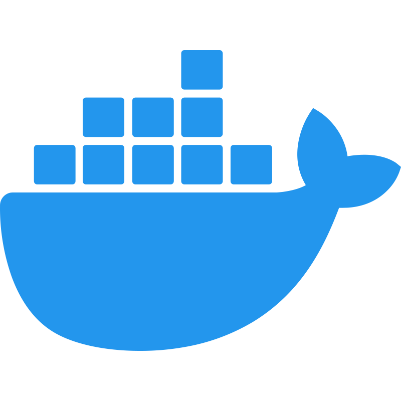

<h1>
   Hello world, I'm Pedro Henrique
   
</h1>

- 🎓 I'm studying Computer Science at [UFCG](https://portal.ufcg.edu.br/)
- 💻 I’m working as Software Engineer at [Smartiks](https://www.smartiks.com)
- 📚 I'm always looking for new knowledge
- 👀 I’m looking to collaborate on **Open Source Projects**
- ❤️ I love new challenges and build software that positively impact people's lives

#

<h3>👨‍💻 Languages and Tools:</h3>

  
  &nbsp;
  
  &nbsp;
  
  &nbsp;
  
  &nbsp;
  
  &nbsp;
  
  &nbsp;
  
  &nbsp;
  
  &nbsp;
  
  &nbsp;
  
  &nbsp;
  
  &nbsp;
  
  &nbsp;
  

#

<h3>📱 Connect with me:</h3>

